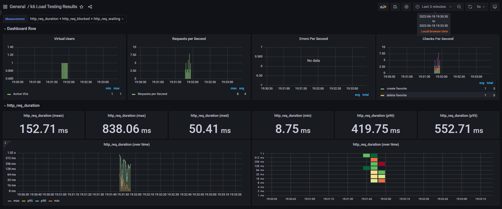
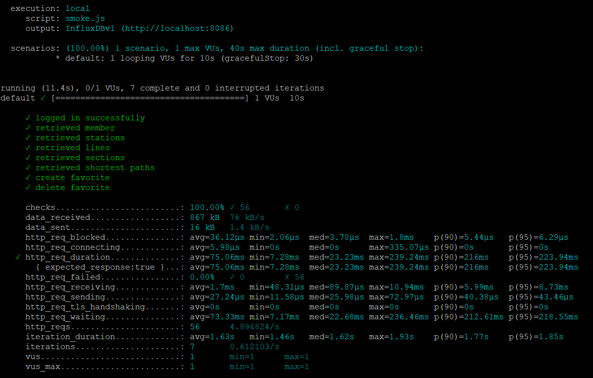
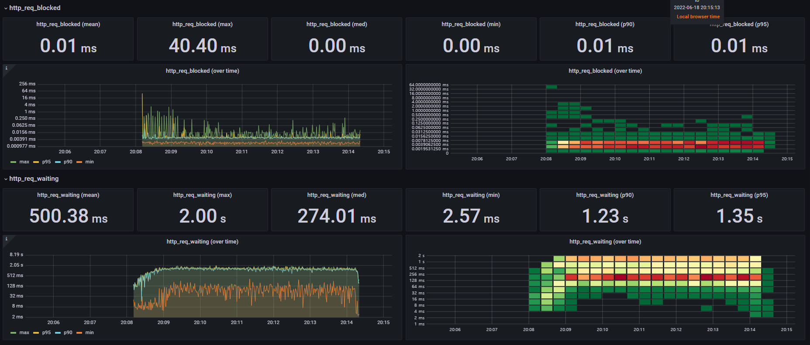
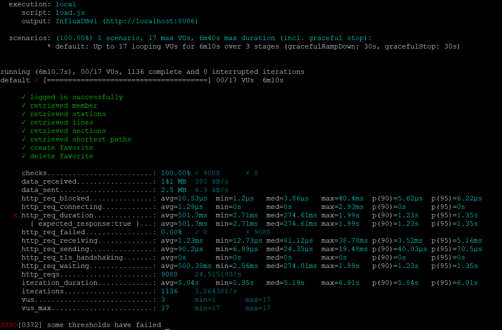
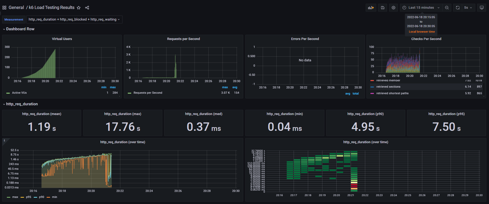
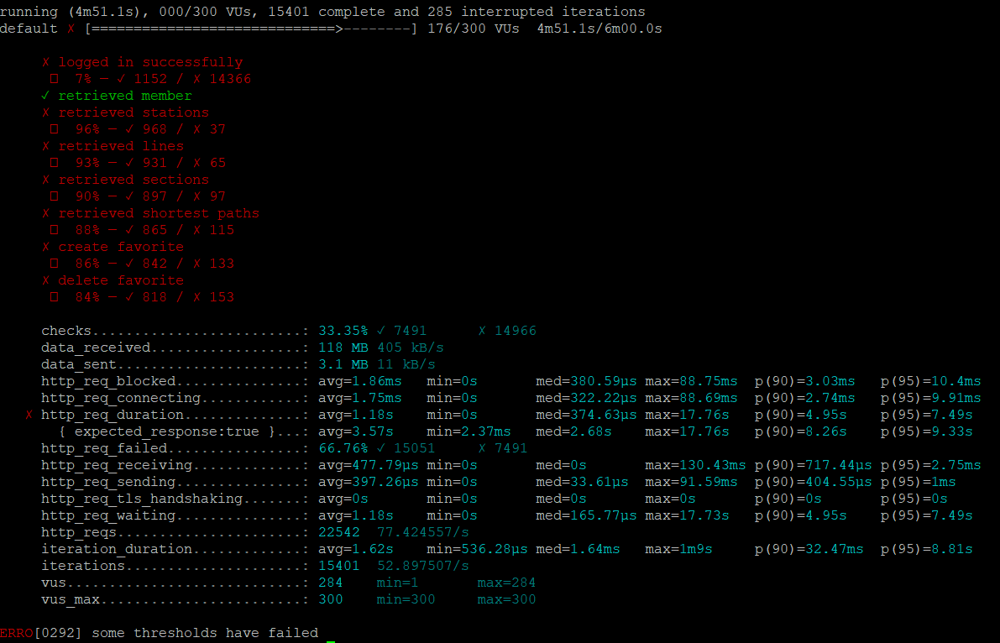

<p align="center">
    
</p>
<p align="center">
  
  
  <a href="https://edu.nextstep.camp/c/R89PYi5H" alt="nextstep atdd">
    
  </a>
  
</p>

<br>

# 인프라공방 샘플 서비스 - 지하철 노선도

<br>

## 🚀 Getting Started

### Install
#### npm 설치
```
cd frontend
npm install
```
> `frontend` 디렉토리에서 수행해야 합니다.

### Usage
#### webpack server 구동
```
npm run dev
```
#### application 구동
```
./gradlew clean build
```
<br>


### 1단계 - 웹 성능 테스트
1. 웹 성능예산은 어느정도가 적당하다고 생각하시나요 

```지하철 경로검색이 주 서비스이기때문에 빠른 상호작용을 확보하는데 유리하도록 웹 성능 예산을 세운다.```
#### Core Web Vitals별 우선순위와 기준 값 
- FID(First Input Delay) : 100ms - 상호작용이 중요하기 때문에 1순위로 고려
- LCP(Largest Contentful Paint) : 2.5s 
- CLS(Cumulative Layout Shift) : 0.1 

#### 정량 기준
  - 이미지 최대크기 300KB 미만
  - 글꼴 개수 2개 미만
  - 번들링된 JS파일 크기 500KB 미만
  - CSS 크기 100KB 미만 

#### 시간 기준
  - TTI(Time To Interactive) : 3.0s  
  - TBT(Total Blocking Time) : 300ms
  - FCP(First Contentful paint) : 1.8s (이탈 방지)

#### 규칙 기준
  - light house 점수 70점 이상 (네이버 지도의 light house 결과 78점 + 20% 고려)
  - page speed 점수 60점 이상 (네이버 지도의 page speed 결과 78점 + 20% 고려)

---
  
2. 웹 성능예산을 바탕으로 현재 지하철 노선도 서비스는 어떤 부분을 개선하면 좋을까요

#### 빠른 상호작용 시간 확보하기
  - 중요하지 않은 웹 리소스들은 TTI 기준 달성 이후 지연 로딩
  - 코드 스플리팅을 통해 필수적인 js 파일만을 우선적으로 로드
    - 요청 수가 증가할수 있지만 빠른 상호작용을 위해 용인함
  - SSR을 통해 CSR에 소비되는 js 실행시간 감소
    - client가 받는 payload가 커지고, server 자원도 더 사용하겠지만 빠른 상호 작용을 위해 용인함 
#### 네트워크 부담 줄이기
  - 이미지 압축, 메시지 gzip 압축을 통해 payload의 용량 감소
  - 이미지, 폰트 캐싱을 통한 요청 수 감소
  
---

### 2단계 - 부하 테스트 
1. 부하테스트 전제조건은 어느정도로 설정하셨나요 

#### 대상시스템범위
- Reverse-proxy(Nginx)
- WAS(Subway Application)
- DB(Mysql)

#### 목표값 설정 
- [데이터로 보는 서울시 대중교통 이용](https://www.bigdata-map.kr/datastory/traffic/seoul) 페이지를 기반으로 목표값을 산정하였음
- DAU : 264만명 (하루평균 이용인원의 60% 수준)
  ```
  2021년 4월 기준 지하철을 하루 평균 4,400,000명이 사용함(승차인원기준)
  ```

- 1인당 1일 평균 접속수 : 1 
  ```
  (근거)
  통계자료는 하루동안의 모든 역에서의 승차인원을 집계한것
  만일 동일인이 하루동안 A역, B역에서 승차한 경우 두번 집계되었을 것으로 예상
  이미 접속횟수가 통계자료에서 반영되어있기때문에 평균 접속수는 1로 잡았음.
  ```

- 초당 평균 이용자 : 264000 / 86400 = 30rps
- Throughput : 25 rps ~ 75 rps, Latency : 100ms
  ```
  출퇴근 시간대(08~09, 18~19)에 이용인원이 100만명 근처로 급격히 증가하는걸 확인할 수 있다.
  출퇴근 시간대를 제외하는 경우 평균적으로 시간 당 30만 ~ 40만명이 이용하는 걸로 보임. (새벽시간 제외)
  따라서 최대트래픽과 평균트래픽의 비율을 약 3:1 정도로 정하였음.
  ```

#### Vuser 산정 
- 산정 결과 : 17 users
- 산정 기준 
  - T = (R * http_req_duration) (+ 1s)
  - R = 8, http_req_duration = 0.1s ==> T = 1.8
  - 목표 RPS : 75
  - Vuser * 8 = 75 * 1.8
  - Vuser = 16.875 

#### 시나리오 (R = 8)
- 로그인
- 내정보 확인
- 역정보 조회
- 노선정보 조회
- 구간정보 조회
- 경로 조회
- 즐겨찾기 추가
- 즐겨찾기 삭제

#### 부하유지시간 
- Smoke : 10s (테스트 오류 없는지 확인용도)
- Load : 1m(ramp up to 17vus), 5m(17vus), 10s(ramp down 0vus) 
- Stress : 1m(20 vus) 1m(50vus) 1m(100vus) 1m(200vus..until error) 1m(ramp down 0vus)
- 
#### 부하 테스트 시 저장될 데이터 건수 및 크기
- 그럴듯한 서비스 미션에서 사용했던 운영 DB 활용
  - 역: 616
  - 노선: 23
  - 구간 : 340
- 즐겨찾기가 지속적으로 추가 및 삭제 됨.  

---

2. Smoke, Load, Stress 테스트 스크립트와 결과를 공유해주세요
#### 테스트 스크립트 
- loadtest 폴더에 있습니다.

#### 결과 캡쳐
- Smoke




- Load




- Stress(245 VU에서 응답 오류 발생)




---

### 3단계 - 로깅, 모니터링
#### 작업목록
- [X] 애플리케이션 진단하기 실습을 진행해보고 문제가 되는 코드를 수정
  - 2단계에서 진행
- [X] 애플리케이션 로그 설정하기
  - boot에서 제공하는 로그 기본설정 최대한 재사용(console log appender, file log appender)
  - local, test, prod profile 활성화시 로깅 용도의 profile도 같이 활성화(spring.profiles.group을 이용)
  - JSON 로그만 모아서 저장(Marker, Filter API 사용)  
- [X] 애플리케이션 이벤트 발생시 로그 기록
- [X] AOP를 이용해서 Controller 메서드 Input/Output 남기기
- [X] 서버에 nginx log 남기도록 처리
- [X] 서버에 aws cloudwatch agent 설치
- [X] actuator 적용하기
- [X] 사용자 정의 대시보드 구성

1. 각 서버내 로깅 경로를 알려주세요 (EC2 인스턴스 명 : mmtos-pub1-web)
- /var/log/syslog
- /var/log/nginx/access.log
- /var/log/nginx/error.log
- /home/ubuntu/nextstep/infra-subway-monitoring/log
  - subway_app.log
  - subway_app.log.json
  
2. Cloudwatch 대시보드 URL을 알려주세요
- https://ap-northeast-2.console.aws.amazon.com/cloudwatch/home?region=ap-northeast-2#dashboards:name=mmtos-dashboard
